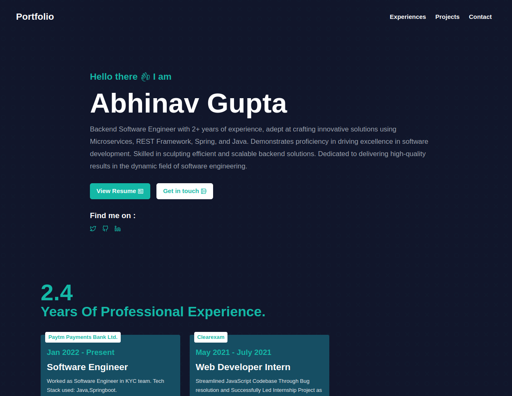

[](#contributors-)

<!-- ALL-CONTRIBUTORS-BADGE:END -->

## Website Screenshot


## Install Dependencies:
First install the needed dependencies:
```bash
npm install
```

## Getting Started
Run the development server:

```bash
npm run dev
# or
yarn dev
```

Open http://localhost:3000 with your browser to see the result.

&copy; 2022 - Made With ❤️ By <b>Abhinav Gupta</b>
